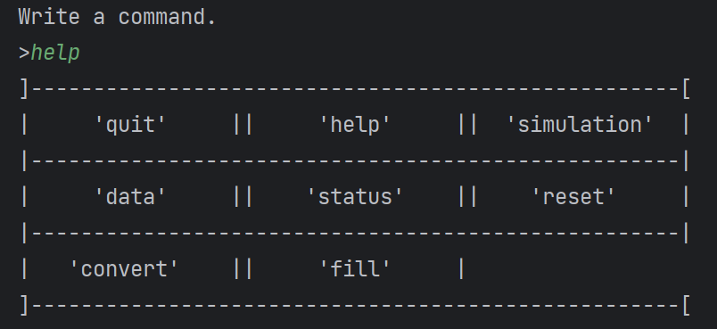
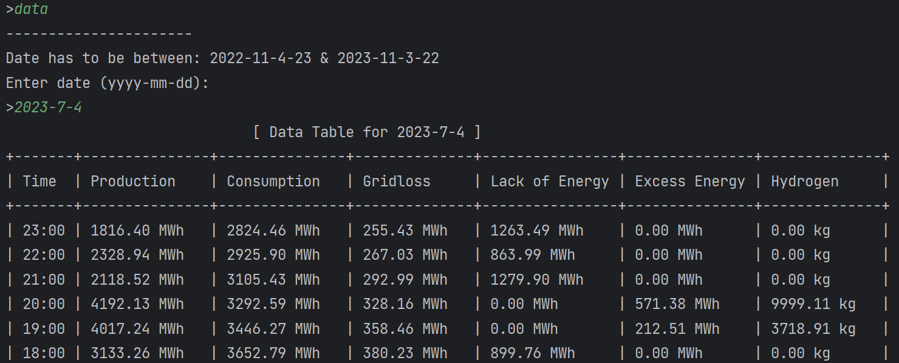
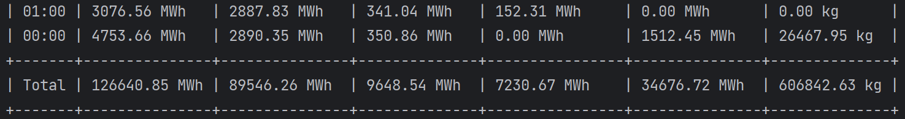
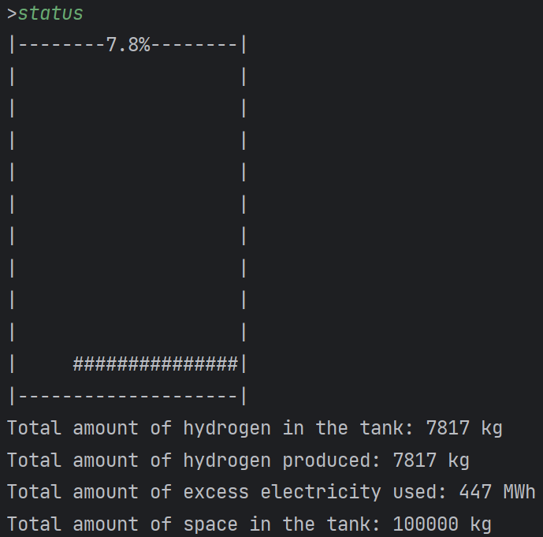

# Energy-Storage

This is a console application, that based on data of electricity from renewable energy
sources, can tell whether it is worth converting electricity to hydrogen.

> This application is made as a part of our P1 Project.

## Building the program.
> To build the program, a licence for CLion is required.

1) Set working directory to the project's main folder.
2) Press "`build`" (The hammer in the header) or "`run`" (The play button in the header).

## Running the program examples.

Examples on running the application:

1) Run "`main`".
1) Type "`help`".
    * This prints all the possible commands available to run.
    

2) Type "`data`".
    * This prompts the user for a date.
    * After date has been input, data for that day will be printed on the screen.
      
      ...
      
3) Type "`simulation`".
    * This prompts the user for a start, and end date.
    * When the two dates have been input, a simulation will run through these dates, and fill a virtual
      tank with hydrogen from the excess electricity.
        * This hydrogen will then be converted back in to electricity in days of underproduction of electricity.

4) After having run "simulation", type "`status`".
    * This will print the current status of the tank.
    * 

5) To fill the tank manually, type "`fill`".
    * This will prompt the user for the amount of hydrogen to fill the tank with.

6) To convert all hydrogen in the tank in to electricity, type "`convert`"

7) To empty the tank, type "`reset`".
    * This will reset everything in the tank.

## About the tests
1) To run the tests, run the "`All CTest`" Configuration.

## Authors

+ [Lasse Moesgaard Ørgaard](https://github.com/LasseOergaardAAU) 
+ [Magnus Hyldgaard Kristensen](https://github.com/MagnusHK3) 
+ [Hera Diep](https://github.com/Hera97) 
+ [Christian Lucas Ry jensen](https://github.com/lucasryy) 
+ [Jonas Stæhr Pedersen](https://github.com/GQ08WF) 

